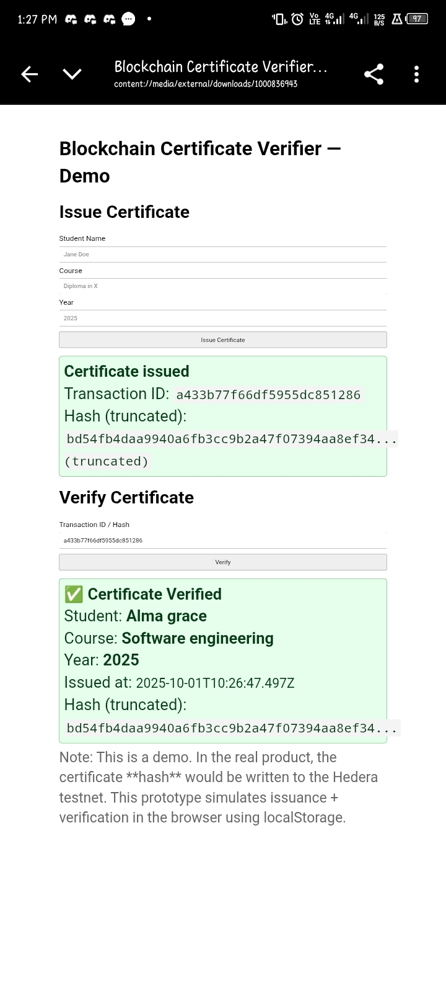

# Blockchain Certificate Verifier

## 🔍 Problem Statement
Fake academic and professional certificates are on the rise, making it hard for employers and institutions to trust credentials. Traditional verification is slow, manual, and often unreliable.

## 💡 Solution
A **Blockchain-powered Certificate Verifier** that allows institutions to issue certificates securely on the Hedera network. Anyone can instantly verify the authenticity of a certificate online using its unique blockchain record.

## ⚙️ How It Works
1. Institution issues a certificate → stored on Hedera blockchain.  
2. Certificate gets a unique hash → linked to the student’s ID.  
3. Employer/Verifier enters the certificate code → system checks blockchain.  
4. Result shows **Valid / Invalid** with certificate details.  

## 🌐 Live Prototype
👉 [View the Demo](https://yourcustomdomain.com)  

## 🖼️ Screenshots

## 🛠️ Tech Stack
- **Frontend:** HTML, CSS, JavaScript  
- **Blockchain:** Hedera Hashgraph (Hedera Consensus Service / Token Service)  
- **Hosting:** GitHub Pages  

## 🚀 Future Improvements
- Add QR code scanning for instant verification  
- Mobile app for easier access  
- Integration with learning platforms (Coursera, Udemy, universities)  

## 👥 Team
- [Your Name] – Product & Design  
- (Add teammates here if any)
