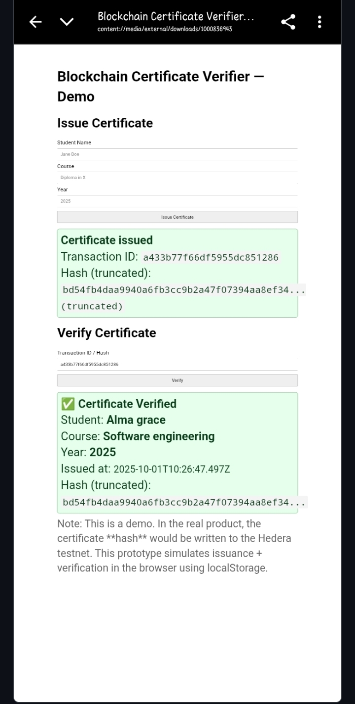

# Blockchain Certificate Verifier  

## Overview  
The **Blockchain Certificate Verifier** is a prototype web application that demonstrates how academic or professional certificates can be issued and verified securely using blockchain principles.  
The project is built for the Hedera Hackathon and is designed to show how distributed ledger technology (DLT) can prevent certificate fraud and provide institutions with a simple, transparent verification tool.  

Unlike traditional paper certificates that can be forged, this system creates a **unique digital fingerprint (SHA-256 hash)** for each certificate and associates it with a **transaction ID**. In a full version, this transaction would be stored on the **Hedera Hashgraph network**, making it tamper-proof and verifiable by anyone.  

---

## Problem Statement  
Certificate fraud is a growing issue worldwide. Employers, universities, and organizations often face challenges validating the authenticity of submitted certificates. Traditional verification methods are time-consuming, centralized, and vulnerable to manipulation.  

---

## Solution  
This demo application shows how institutions can:  
- Issue certificates digitally with unique identifiers.  
- Record certificate authenticity using blockchain technology.  
- Allow third parties (employers, schools, organizations) to verify certificates instantly with just a transaction ID.  

The prototype here simulates blockchain storage using the browser’s `localStorage`, but the flow is designed to be compatible with Hedera Hashgraph in a production version.  

---

## Features  
- **Certificate Issuance**: Input student details (name, course, year) and generate a certificate record.  
- **Transaction ID Generation**: A unique transaction ID and hash are created for each issued certificate.  
- **Verification**: Users can paste a transaction ID to verify certificate details.  
- **Download/Copy**: Certificates can be downloaded as JSON or copied for easy sharing.  
- **Local Record**: Stores a list of issued certificates for demo purposes.  
- **User-Friendly**: Simple, mobile-responsive interface for issuing and verifying certificates.  

---

## Demo  
🔗 **[View Live Demo](https://sinclair22brown-cell.github.io/Hedera-hackathon-demo/)**  

---

## Screenshots  
  

---

## How to Use  

### Issuing a Certificate  
1. Open the demo application.  
2. Enter the student’s name, course, and year.  
3. Click **Issue Certificate**.  
4. A unique transaction ID and hash will be generated.  
5. Copy the transaction ID or download the certificate as JSON.  

### Verifying a Certificate  
1. Go to the **Verify** section of the app.  
2. Paste the transaction ID you received.  
3. Click **Verify**.  
4. The app will confirm whether the certificate exists and display the details.  

---

## Technical Details  

- **Frontend**: HTML, CSS, JavaScript  
- **Hashing Algorithm**: SHA-256 (browser native crypto API)  
- **Data Storage (demo)**: Browser `localStorage`  
- **Hosting**: GitHub Pages  
- **Blockchain Target (production)**: Hedera Hashgraph Consensus Service (HCS)  

---

## Future Improvements  
- Integration with Hedera testnet for actual certificate storage.  
- Batch verification for multiple certificates.  
- Institution login/dashboard.  
- QR code generation for easy certificate verification.  
- Improved styling and UX with frameworks (React, Tailwind, etc.).  

---

## Installation & Setup  

To run locally:  
```bash
git clone https://github.com/sinclair22brown-cell/Hedera-hackathon-demo.git
cd Hedera-hackathon-demo
